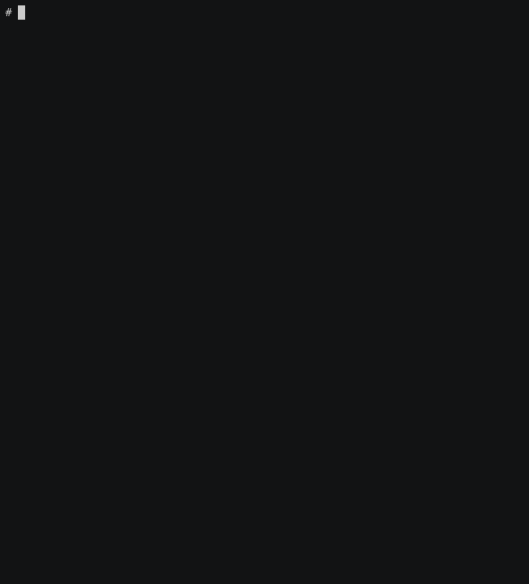

<!-- DOCTOC SKIP -->

## Welcome to Adapt

Adapt is the easiest way to reliably and repeatably deploy your apps anywhere -- to your laptop, a Kubernetes cluster, your favorite cloud, or anywhere else. Adapt specifications look like [ReactJS](https://reactjs.org) apps, but instead of rendering browser DOM elements like input, or div, Adapt specifications render to DOM elements like AWS EC2 instances, Lambdas, Kubernetes Pods, or any other building block for your application architecture.  If you are already familiar with React, many of the concepts will look familiar. If not, don't worry, knowledge of React isn't required to start using Adapt.

## Getting Started
For a new project, you can get started without knowing much about Adapt by using a starter.  The [Getting Started Guide](https://adapt.unbounded.systems/docs/getting_started) will walk through installing Adapt and deploying a starter project.
```shell
adapt new <starter> <project directory> #Create a new project from a starter
adapt run --deployID <myID> #Create a new deployment of the starter project
... #write some code
adapt update <myID> #Update the running deployment
```

Deploy a sample application with a [React](https://reactjs.org) front-end, a [Node.js](https://nodejs.org) API server, and a [Postgres](https://postgresql.org) database, along with a static file server and a URL router:



A snippet of the corresponding Adapt specification that the starter sets up for this example:
```jsx
import { HttpServer, UrlRouter } from "@adpt/cloud/http";
import { NodeService } from "@adpt/cloud/nodejs";
import { Postgres } from "@adpt/cloud/postgres";
import Adapt, { Group, handle } from "@adpt/core";
import { k8sStyle, laptopStyle, prodStyle } from "./styles";

function App() {
    const pg = handle();
    const api = handle();
    const stat = handle();

    return <Group key="App">

        <UrlRouter
            port={8080}
            routes={[
                { path: "/api/", endpoint: api },
                { path: "/", endpoint: stat }
            ]} />

        <NodeService handle={api} srcDir=".." connectTo={pg} />

        <Postgres handle={pg} />

        <HttpServer handle={stat} scope="cluster-internal"
            add={[{ type: "image", image: api, stage: "app",
                    files: [{ src: "/app/build", dest: "/www/static" }]}]} />

    </Group>;
}

Adapt.stack("default", <App />, k8sStyle);
```

## More Information

Our documentation is a work in progress, so it may not have all the answers you're looking for yet.
If you haven't found what you need, please ask a question on our [Gitter channel](https://gitter.im/UnboundedSystems/Adapt) or [file an issue](https://gitlab.com/unboundedsystems/adapt/issues).

## Adapt Basics
- [Getting Started Guide](getting_started/index.md)
- [Tutorial: Intro to Adapt Concepts](tutorial_concepts/index.md)

## Advanced Adapt Topics
- [Core API Reference Guide](api/core/index.md)
- [Cloud API Reference Guide](api/cloud/index.md)
- [Concepts: Comparing Adapt and React](comparing_react/index.md)

## Contributing to Adapt

If you're interested in contributing to Adapt, that's awesome!
Chat with us on our [Gitter channel](https://gitter.im/UnboundedSystems/Adapt) and we can help you get started.

### Adapt developer docs
- [Setup](developer/setup.md)
- [Writing Docs](developer/writing_docs.md)
