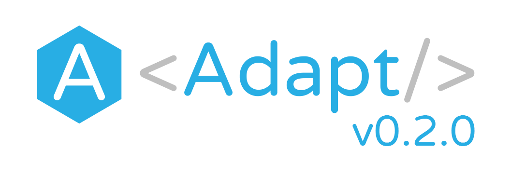

Adapt version 0.2.0 adds support for additional Node.js versions, adds configuration options for the CLI, simplifies the installation process, lays the foundation for easier upgrades, and fixes a few bugs.

<!--truncate-->

## Now supporting Node.js 10, 12, and 13

The initial releases of Adapt began by supporting only Node.js 10 for running the Adapt CLI and its associated libraries (primarily the `core` and `cloud` libraries).
But starting with Adapt 0.2.0, we have expanded our Node.js support to include all [Node.js releases](https://nodejs.org/en/about/releases/) with Status `Current`, `Active LTS`, or `Maintenance LTS`.

This release fixes a couple of issues found when running Adapt on Node.js 12 and 13 and adds testing of Adapt on v12 and v13 to our CI.

Note that even though Adapt itself requires certain versions of Node.js, Adapt can be used to build and deploy apps that use **any** version of Node.

## Configuration options for the CLI

Two new commands have been added to the Adapt CLI:

* [`adapt config:set`](https://github.com/unboundedsystems/adapt/tree/master/cli#adapt-configset-name-value) modifies configuration settings for the CLI

* [`adapt config:list`](https://github.com/unboundedsystems/adapt/tree/master/cli#adapt-configlist) shows the current configuration settings for the CLI

## Making Adapt installation easier

To make the Adapt installation process easier, this release also removes the requirement for the `yarn` package manager to be separately installed on the host system.
Adapt still uses `yarn` internally, but it is now bundled within Adapt as a dependency.

Our goal is to simplify this further in the future by building and releasing Adapt packages for native package managers on popular operating systems.

## Adapt upgrades

This release also contains the first features to make it easier to upgrade Adapt, with the eventual goal of enabling automatic upgrades or "one touch" manual upgrades, depending on user preference.
The Adapt CLI now has the ability to notify you when a newer release of Adapt is available.
You can choose to get notifications for either of the two Adapt release channels:

* The `latest` channel contains the more stable releases and is the default, which is recommended for most users.

* The `next` channel contains more frequent releases, for users that want to work with the bleeding edge of Adapt.

You can select which channel to receive notifications for with the following command:

```bash
adapt config:set upgradeChannel CHANNEL
```

## Bug fixes & more

There are also several bug fixes included in this release as well as improvements to testing, CI stability, and more.
For more information, see the [full list of changes since v0.1.0](https://github.com/unboundedsystems/adapt/compare/v0.1.0...v0.2.0).

## Upgrading to v0.2.0

For instructions on upgrading the Adapt CLI and your Adapt projects, see [Upgrading Adapt](../../../../docs/user/install/upgrade).

## About Adapt

Adapt.js is a developer-friendly way of specifying and deploying your application back-end.
Adapt.js specifications look and feel like [React](https://reactjs.org) projects, but instead of rendering widgets in a browser, you render various artifacts, like Docker images, [Node.js](https://nodejs.org) services, [Kubernetes](https://kubernetes.io) Pods, or anything else needed to build and deploy your application back-end.
Learn more about it at [adaptjs.org](https://adaptjs.org).
